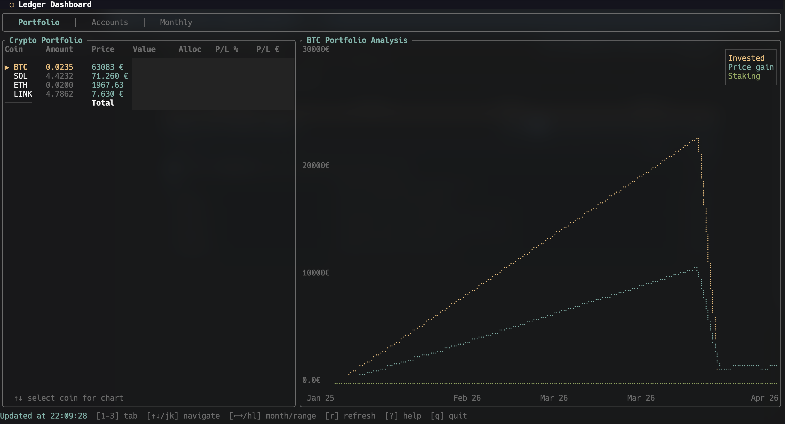
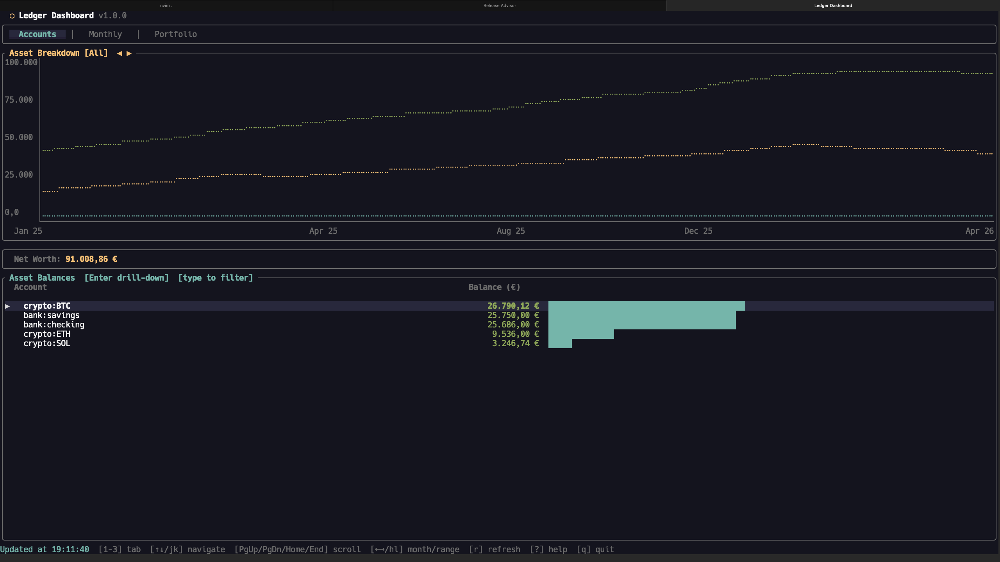
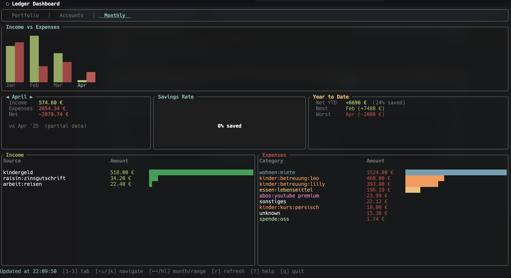

# ⬡ ldash — HLedger Dashboard TUI

A terminal dashboard for [hledger](https://hledger.org) that gives you a real-time overview of your finances — crypto portfolio, net worth, and monthly income/expenses — all without leaving the terminal.

Built with [Ratatui](https://ratatui.rs) and Rust.

## Screenshots

| Portfolio | Accounts | Monthly |
|:---------:|:--------:|:-------:|
|  |  |  |

## Features

- **Crypto Portfolio** — Holdings table with price, value, allocation %, and P/L tracking (invested vs price gain vs staking rewards)
- **Portfolio Chart** — Per-coin analysis with two modes: *stacked* (invested / purchased value / total value) or *unstacked* (invested / price gain / staking gain). Toggle with `s`.
- **Net Worth History** — Interactive chart with selectable time ranges (YTD / 1Y / 2Y / 5Y / All)
- **Account Balances** — All asset accounts with EUR valuations and visual bar indicators, plus a stacked asset breakdown chart
- **Account Drill-Down** — Enter on an account opens the Register tab for that account and the current month
- **Transaction Register** — month of postings grouped by transaction. `/` focuses the query bar. `h`/`l` changes month. Enter opens the transaction's legs
- **Monthly Income & Expenses** — Bar chart overview with per-category breakdown, 6-month trend sparklines, savings rate gauge, and year-over-year comparison
- **Cash Flow Forecast** — Projected income/expenses for future months via `hledger --forecast`, overlaid on the monthly chart
- **Recurring Expense Detection** — Automatically identifies subscription and recurring charges in your expense history
- **Budget Tracking** — Set monthly limits per expense category; see progress bars inline and warnings when over budget
- **Savings Goals** — Define target amounts for account prefixes; progress bars shown on the Accounts tab
- **Automatic Price Fetching** — Fetches spot prices from CoinGecko at startup (once per day) and appends them to `prices.journal`; press `P` to fetch on demand. No external script needed.
- **Background Refresh** — Non-blocking data loading with parallel hledger calls
- **Auto-Refresh** — Detects journal file changes and reloads automatically
- **Lazy Tab Loading** — Only loads data for the active tab on first visit

## Requirements

- [Rust](https://rustup.rs) (1.70+)
- [hledger](https://hledger.org/install.html) installed and available in `$PATH`
- An hledger journal file with a companion `prices.journal` for crypto price history

## Installation

### Homebrew (macOS / Linux)

```bash
brew tap md-weber/ldash
brew install ldash
```

### From source

```bash
git clone https://github.com/md-weber/ldash.git
cd ldash
cargo install --path .
```

## Usage

```bash
# Pass journal path directly
ldash -f /path/to/all.journal

# Or set the environment variable
export LEDGER_FILE=/path/to/all.journal
ldash

# Or run from a directory containing all.journal
cd ~/Finance && ldash
```

## Keybindings

| Key | Action |
|-----|--------|
| `1` / `2` / `3` / `4` | Accounts / Monthly / Register / Portfolio |
| `Tab` / `Shift-Tab` | Next / previous tab |
| `↑` `k` / `↓` `j` | Scroll / select |
| `PgUp` / `PgDn` | Page up / down |
| `Home` / `End` | Jump to first / last row |
| `←` `h` / `→` `l` | Month (Monthly, Register) / net worth range (Accounts) / chart range (Portfolio) |
| `y` / `Y` | Previous / next year (Monthly tab) |
| `G` | Jump to latest month (Monthly tab) |
| `i` | Toggle income / expense focus (Monthly tab) |
| `p` | Payee analytics (Monthly tab) |
| `C` | Year-over-year chart (Monthly tab) |
| `F` | Current-month forecast remainder (Monthly tab) |
| `Enter` | Open Register from an account or category / open transaction legs on Register |
| `s` | Toggle portfolio chart stacked / unstacked |
| `c` | Toggle expense category colors |
| `/` | Register query bar (description filter) |
| `e` | Export current view to file |
| `Y` | Copy current view to clipboard (non-Monthly) |
| `Ctrl-O` | Open journal-switch prompt (session only) |
| `Ctrl-S` | Save typed/active journal to config (inside `Ctrl-O` prompt) |
| `r` | Force refresh |
| `P` | Fetch prices from CoinGecko (requires `[price_fetch]` config) |
| `?` | Toggle help overlay |
| `Esc` | Back / close |
| `q` | Quit |

## Configuration

On first launch, ldash creates a config file at `~/.config/ldash/config.toml` with all options commented out. Edit it to customize behavior.

```toml
# Path to hledger journal (overrides $LEDGER_FILE; CLI -f still wins)
# journal = "/path/to/all.journal"

# Auto-refresh interval in seconds (default: 300)
# refresh_interval = 300

# Default tab on startup: "portfolio", "accounts", "monthly", "register"
# default_tab = "accounts"

# Number format: "eu" (1.000,00) or "us" (1,000.00)
# number_format = "eu"

# Currency symbol shown in UI
# currency_symbol = "€"

# Portfolio chart mode: "stacked" or "unstacked" (default: "stacked")
# chart_mode = "stacked"

# Price alert threshold in percent (default: 2.0)
# Popup shows only coins with day-over-day move >= threshold.
# Set 0.0 to show all daily moves.
# price_alert_threshold_pct = 2.0

# Quick-switch journal list — cycle through with ↑/↓ inside the Ctrl-O prompt.
# journals = [
#   "/path/to/personal.journal",
#   "/path/to/work.journal",
# ]

# Account prefixes treated as liquid cash (Monthly tab "Liquid Chg").
# Empty (default) hides the figure.
# liquid_accounts = [
#   "assets:bank:checking",
#   "assets:cash",
# ]

# Expense category color overrides
# Colors: red, green, blue, yellow, cyan, magenta, white, darkgray,
#         or RGB hex like "#B48CFF"
# [colors.expenses]
# Wohnen = "blue"
# Essen = "yellow"

# Monthly budget limits per expense category
# Matched against your hledger expense accounts (case-insensitive).
# Shows a progress bar in the expense table and warns when over budget.
[budgets]
# "expenses:Essen" = 400.0
# "expenses:Freizeit" = 200.0
# "expenses:Transport" = 150.0

# Savings goals — track progress toward financial targets.
# Each goal maps a target amount to an account prefix. Shown on
# the Accounts tab as a progress bar with current/target amounts.
# [[goals]]
# name = "Emergency Fund"
# target = 15000.0
# account = "assets:bank:savings"

# Automatic price fetching from CoinGecko.
# At startup ldash checks whether today's prices are already in prices.journal;
# if not, it fetches them in the background. Press P to fetch on demand.
# [price_fetch]
# currency = "eur"
# [[price_fetch.tokens]]
# symbol = "BTC"
# id     = "bitcoin"
# [[price_fetch.tokens]]
# symbol = "ETH"
# id     = "ethereum"
# [[price_fetch.tokens]]
# symbol = "SOL"
# id     = "solana"
```

Missing or partially filled config is fine — defaults fill any gaps.

### Theming

ldash ships three built-in presets. Set one in your config:

```toml
[theme]
preset = "dark"        # default — dark background, cyan accent
# preset = "light"    # light background, blue accent (self-contained: works on any terminal)
# preset = "solarized" # Solarized Dark palette
```

Every color can also be overridden individually, with or without a preset:

```toml
[theme]
preset  = "solarized"
accent  = "#ff8800"   # override just the accent color
```

Available color fields and their defaults (dark preset):

| Field | Default | Role |
|-------|---------|------|
| `accent` | `cyan` | Borders, highlights, selected tab |
| `positive` | `green` | Income, gains, positive amounts |
| `negative` | `red` | Expenses, losses, negative amounts |
| `muted` | `darkgray` | Secondary text, axis labels |
| `gold` | `yellow` | Net worth line, titles, P/L totals |
| `fg` | `white` | Primary text |
| `background` | `#14141e` | Title bar, popup backgrounds |

Color values accept named colors (`red`, `green`, `blue`, `yellow`, `cyan`, `magenta`, `white`, `gray`, `darkgray`) or hex codes (`#RRGGBB`).

Theme changes take effect immediately when the config file is saved (hot-reload — no restart needed).

## Journal Structure

ldash expects a standard hledger setup:

```
~/Finance/
├── all.journal          # main journal (includes others)
├── prices.journal       # P directives for crypto prices
├── 2025.journal
└── 2026.journal
```

Crypto accounts should live under `assets:crypto`, and price entries in `prices.journal` should follow the format:

```
P 2026-04-14 BTC 76543,21 €
P 2026-04-14 SOL 123,45 €
```

## License

GPL-3.0-or-later — see [LICENSE](LICENSE) for the full text.
